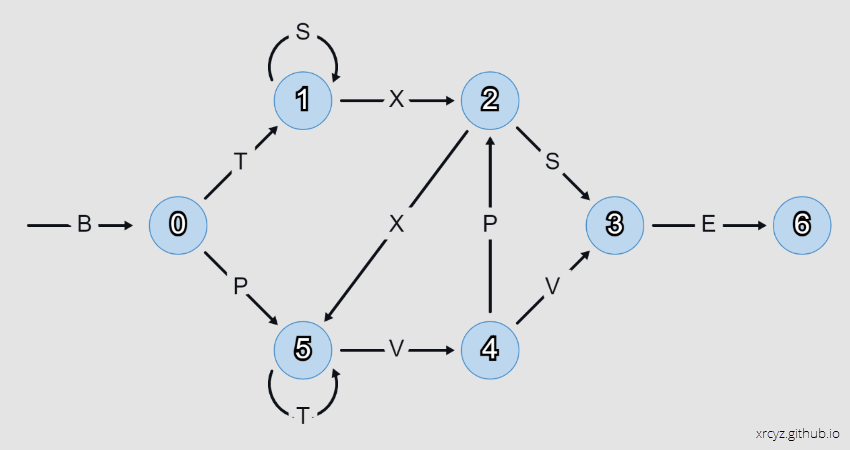

I made a toy LSTM to help me understand the concepts underlying [Long-Short Term Memory](https://colah.github.io/posts/2015-08-Understanding-LSTMs/) recurrent neural networks. It solves a simple task - given a string of characters, predict the next character according to the Reber Grammar. 

<p align="center">
    
</p>

The interesting part of this project is that I derived the weights by hand, without using back-propagation, to see if I could gain an insight into how an LSTM makes its predictions. 

If you want to follow along in the animation, you can do it [here](https://xrcyz.github.io/Toy-LSTM/). 

<p align="center">
    
</p>

The internal logic of this LSTM is remarkably simple. You could implement it in Microsoft Excel. 

## Input 

The `input` array is a one-hot vector representing the last character of the string. At time zero, we initialise this to the letter B. 

```js
let input   = [1,0,0,0,0,0,0]; //current token [B,T,S,X,P,V,E]
```

## Hidden State

> Throughout this section I will use to `node[i]` to refer to the index of the current node in the Reber Grammar graph. 

### Memory State

The `memory` array is a one-hot vector representing the state of the Reber Grammar (the index of the current node in the graph). 

```js
let memory  = [0,0,0,0,0,0]; //current node in the graph: [0,1,2,3,4,5]
```

### Memory Updates

The `eraser`, `writer`, and `filter` arrays are responsible for updating the memory vector. This is equivalent to crossing an edge in the graph and moving to a new state. 

```js
let eraser  = [0,0,0,0,0,0]; //what to erase in memory
let writer  = [0,0,0,0,0,0]; //what to write to memory
let filter  = [1,1,1,1,1,1]; //filter the writer when it returns multiple write values
```

Whenever the LSTM receives a new input, the `eraser`, `writer`, and `filter` perform a test on each node to see if its preconditions have been met. For example, here is the test for `node[0]`:

```js
eraser[0] = 0;                  //always reset
writer[0] = Math.tanh(5 * B);   //if we get a B, then 100% we arrived at node 0
filter[0] = 1;                  //never filter
```

From there we might move to `node[1]`. This node is interesting for two reasons: 
- We don't want to erase the memory if the graph loops on `S`.
- We don't want to increment the memory if the graph loops on `T` at `node[5]`.

This is where the `eraser` and `filter` tests come into play:

```js
eraser[1] = 1 / (1 + exp(-10 * (0.5 - X)));                     //reset on X (exit node 1)
writer[1] = Math.tanh(5 * T);                                   //if we get a T, then ring the bell for node[1]
filter[1] = 1 / (1 + exp(-30 * (0.75 - memory[5])));            //but only if we are not on node 5
```

Note that I am taking moderate care to ensure that the firing threshold for each node in memory is approximately `1.0`. This becomes important in the `reader` layer, when we need to test multiple nodes to predict a single character. A node may accumulate evidence when precedent edges are crossed, but is not considered 'active' until it crosses the firing threshold. 

With that in mind, let us now consider `node[2]`, which may be reached by `T(SSS)X` or `X(TTT)VP`. In the `writer` I use a factor of `0.55` to increment the memory by half if a precedent edge `T`, `X`, or `P` is crossed. This covers the cases for `TX` (via node 1) and `XP` (via node 5). Finally, the filter is set to ignore `T` when it loops on `node[5]`. 

```js
eraser[2] = 1 / (1 + exp(-30 * (0.65 - memory[2])));            //reset on exit
writer[2] = Math.tanh(0.55 * (T + X + P));                      //breadcrumbs to node 2
filter[2] = 1 / (1 + exp(-30 * (0.65 - memory[5])));            //do not increment from node 5
```

With `node[3]`, I apply weights to `S` and `V` to catch the precedent sequences `S` and `VV`. The `eraser` resets on `P` to avoid sequence `VPS`, and the filter blocks the looping `S` on `node[1]` to avoid sequence `SSS`.  

```js
eraser[3] = 1 / (1 + exp(-10 * (0.5 - P)));                     //reset on P
writer[3] = Math.tanh(3.0 * S + 0.55 * V);                      //breadcrumbs to node 3
filter[3] = 1 / (1 + exp(-10 * (0.7 - memory[1])));             //do not increment from node 1
```

`node[4]` presents a refreshingly simple case, where we can increment on `V` and immediately erase/filter on exit.

```js
eraser[4] = 1 / (1 + exp(-10 * (0.6 - memory[4])));             //reset on exit
writer[4] = Math.tanh(5 * V);                                   //breadcrumbs to node 4
filter[4] = 1 / (1 + exp(-10 * (0.6 - memory[4])));             //filter V on exit
```

`node[5]` filters inputs from `node[1]`, allowing it to trigger on sequences `BP` and `X`. The `eraser` resets the state on exiting across edge `V`.

```js
//BP, XX, PX but not BX
eraser[5] = 1 / (1 + exp(-10 * (0.5 - S - V)));                 //reset on S,V
writer[5] = Math.tanh(0.55 * B + 0.7 * P + 5 * X);              //breadcrumbs to node 5
filter[5] = 1 / (1 + exp(-30 * (0.65 - memory[1])));            //do not increment from node 1
```

## Readout

The `reader` layer is a one-hot vector representing the probability of yielding a specified character. Each element of he `reader` performs a test of the `memory` vector, to determine if the current state could yield a given character.

```js
reader[0] = 0; //we never yield B
reader[1] = Math.tanh(5 * (memory[0] + memory[5] - 0.7)); //T may yield from 0 or 5
reader[2] = Math.tanh(5 * (memory[1] + memory[2] - 0.7)); //S may yield from 1 or 2
reader[3] = Math.tanh(5 * (memory[1] + memory[2] - 0.7)); //X may yield from 1 or 2
reader[4] = Math.tanh(5 * (memory[0] + memory[4] - 0.7)); //P may yield from 0 or 4 
reader[5] = Math.tanh(5 * (memory[4] + memory[5] - 0.7)); //V may yield from 4 or 5
reader[6] = Math.tanh(5 * (memory[3]             - 0.7)); //E may yield from 3
```

