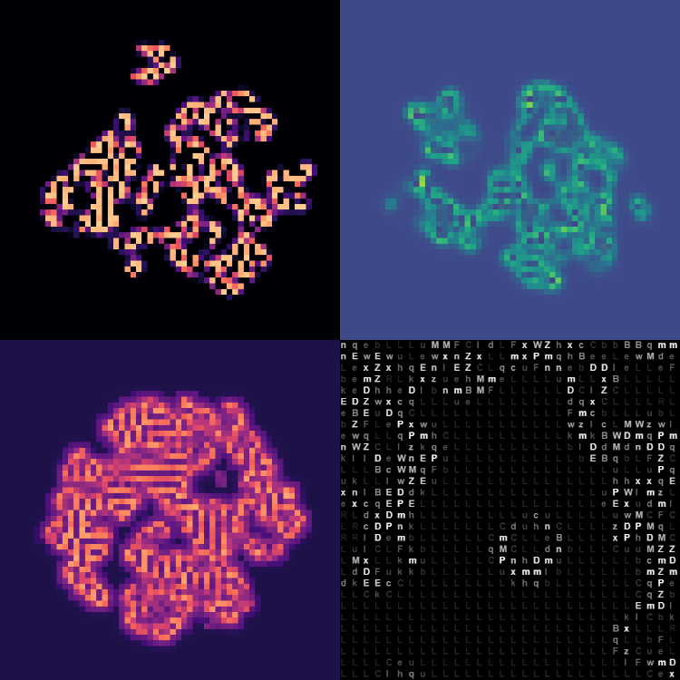
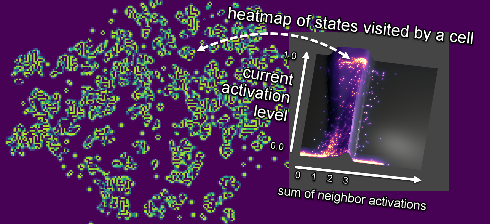
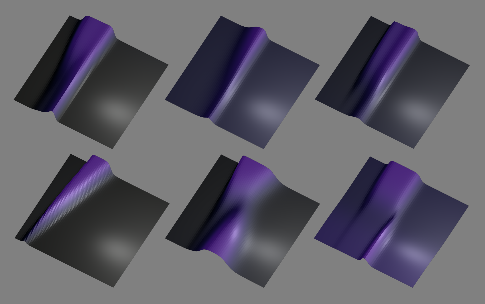

One year ago I decided that I would hand-weight a neural network in order to understand how it works. I felt like I could read all the matrix math and draw all the network diagrams and still have no idea why answers come out when inputs go in. I needed to strip and rebuild a neural network bolt by bolt, weight by weight, to see inside the forbidden blackbox. 

Since then I've made a [post](../_posts/NN-Boolean-Algebra.md) about my current mental model. I'm not going to cover that ground again. Instead I want to summarise my journey from Conway's Game of Life to 3D rendering a neural reaction diffusion model. 

## Conway's Game of Life

I picked the update rule for Conway's Game of Life because it was the simplest interesting program I could think of. If a cell is active and has 2 or 3 neighbors, it stays active. If an inactive cell has exactly 3 neighbors, then it activates. All other cells become inactive. From these simple rules we get the vast panoply of patterns so far discovered. 

```js
if(self == 1 && neighbors == (2|3)) return 1;
if(self == 0 && neighbors == 3) return 1;
else return 0;
```

We can represent this as a neural network [like so](https://openprocessing.org/sketch/1236584):

```js
//input layer
let self, count; 

//layer 1
let selfIsOne = 1 /  (1 + exp(-10 * ( self - 0.5))); 
let peersOver1 = 1 / (1 + exp(-10 * ( count - 1.5 ))); 
let peersOver2 = 1 / (1 + exp(-10 * ( count - 2.5 ))); 
let peersOver3 = 1 / (1 + exp(-10 * ( count - 3.5 ))); 

//layer 2
let self0peers3 =    1 / (1 + exp(-10 * (-selfIsOne + peersOver2 - peersOver3 - 0.5)));
let self1peers2or3 = 1 / (1 + exp(-10 * ( selfIsOne + peersOver1 - peersOver3 - 1.5)));

//output layer
let activation = 1 / (1 + exp(-10 * ( self0peers3 + self1peers2or3 - 0.5 ))); 
```

Naturally I was curious to see what happens with different weights and biases, so I parameterised them and spent way to much time hitting refresh to explore the state space. 

<p align="center">
    
</p>

At this point it occurred to me that the neural network can be plotted as a function `z = f(x,y)`, where `x` is the current cell state and `y` is the neighborhood sum. I could plot each rule set and, more importantly, reason about them as functional programs that map inputs to outputs. It feels much more natural to me to read a neural network as a tree of nested functions (output to input) than as a pipeline of operations (input to output). 

I started reading some shaders by [Paul Wheeler](https://openprocessing.org/user/254459?view=sketches), [Sayama](https://openprocessing.org/user/159668?view=sketches), [MathFoxLab](https://openprocessing.org/user/161812?view=sketches) and others on OpenProcessing, and eventually hacked together a visualisation. 

<p align="center">
    <a href="https://openprocessing.org/sketch/1254639">
        
    </a>
</p>

The code in this [sketch](https://openprocessing.org/sketch/1254639) is hot garbage, but its still kinda cool. You can select from a dozen or so cellular automatas and see the 3D plot of the neural network update rule, as well as a heatmap of states visited by a cell over time. The big takeaway that I got from this is that the weights and biases just push around slopes on a heightmap. 

<p align="center">
    
</p>

## Multiple Neighborhood Cellular Automata 

Drunk with power, I decided to add a third input to the neural network and try to imitate some of the [outstanding results](https://www.youtube.com/watch?v=5TstDc_ed-4) created by [Slackermanz](https://slackermanz.com/understanding-multiple-neighborhood-cellular-automata/). Unfortunately I did not get C. elegans on the first go, but I did manage to get some motile cells and cell division, which was exciting. 

<p align="center">
    <a href="https://openprocessing.org/sketch/1360946">
        
    </a>
</p>

A possible direction of future work would be to transcribe Slackermanz rulesets into neural functions and see if there is any commonality to the function shapes, then you might be able to predict interesting rulespaces as a result. 

## Raymarching 3D textures

In Feb 2020 the article [Growing Neural Cellular Automata](https://distill.pub/2020/growing-ca/) dropped on Distill, with its mind-blowing demonstration of cellular automata to regenerate images from a single pixel. Then in June 2021 the paper [Differentiable Programming of Reaction-Diffusion Patterns](https://selforglive.github.io/alife_rd_textures/) showed examples of 'volumetric texture synthesis', where 2D update rules can be applied to spaces of higher dimensionality. I decided to try it.

Up until this point I had been copying and pasting snippets of shader code without really understanding why they work. I took a detour through [Introduction to Computer Graphics](https://math.hws.edu/graphicsbook/index.html) to learn the minimum OpenGL. Then I used the [Volumetric Sandbox](https://www.shadertoy.com/view/Ml3SD4) by Flyguy as a template for raymarching 3D textures. I also referenced a lot of code from [Paul Wheeler](https://openprocessing.org/user/254459?view=sketches) and [Dave Pagurek](https://openprocessing.org/user/67809?view=sketches) on OpenProcessing.

I'm still a novice shader programmer, but I'm happy with how it's looking. 

<p align="center">
    
</p>

Which brings us to the current state of play: I expanded the cell neighborhoods to implement Young's model of reaction diffusion. Each voxel receives an activation signal from an inner envelope and an activation signal from an outer envelope. The neural network takes the current voxel state, the activation signal and the inhibitor signal, and computes a new voxel state. 



What is interesting to me at present is that you could run reaction diffusion in a 3D texture in order to output a 2D video of cell mitosis. Time is just another dimension. Theoretically you could generate arbitrary rulesets for 2D cellular automata by training against a target 3D texture, right? And then do the same thing with a voxel scene by targeting a 4D texture. It's turtles all the way up...

If you read this far and you want to keep in contact, please give me a follow on [Twitter](https://twitter.com/planet403).

## References
Links to various people or channels whose work helped me in this project. 

- [Coding Train](https://www.youtube.com/channel/UCvjgXvBlbQiydffZU7m1_aw)
- [Sayama](https://openprocessing.org/user/159668?view=sketches)
- [MathFoxLab](https://openprocessing.org/user/161812?view=sketches)
- [Paul Wheeler](https://openprocessing.org/user/254459?view=sketches)
- [Slackermanz](https://slackermanz.com/understanding-multiple-neighborhood-cellular-automata/)
- [Alex Mordvintsev](https://twitter.com/ak92501/status/1465152668817670150)
- [Flyguy](https://www.shadertoy.com/view/Ml3SD4)
- [Softology blog](https://softologyblog.wordpress.com/2019/12/28/3d-cellular-automata-3/)
- [David Eck](https://math.hws.edu/graphicsbook/index.html)
- [Bert Chan](https://arxiv.org/abs/1812.05433)